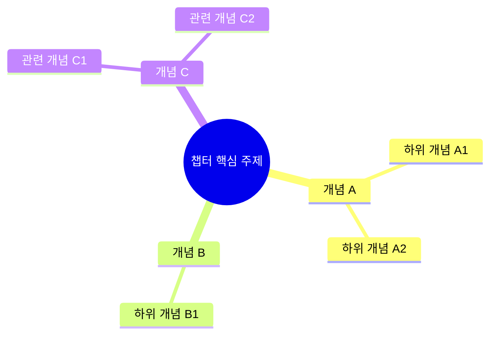

# Study Companion — 런타임 매뉴얼 v2.3 — Long-Term Memory Edition

> **지원 플랫폼**: Windows 10/11 및 macOS (Monterey 이상)  
> **연결 필수 MCP**: `notebooklm`, `memory`, `obsidian-mcp-tools`  
> **선택적 MCP**: `sequential-thinking` (인포그래픽 생성 시)  
> 노트 저장: `obsidian-mcp-tools` MCP를 통해 연결된 Obsidian 볼트에 저장  
> 사용자 데이터: Windows `%USERPROFILE%\.study-companion\` / macOS `~/.study-companion/`

---

## § 1. 사용자 의도 분류 (Intent Router)

스킬 활성화 직후, 사용자 발화에서 의도를 다음 표의 하나로 분류하라.

| 의도 | 트리거 패턴 | 진입 함수 |
|------|-----------|---------|
| `START_NEW` | "공부 시작", "새 커리큘럼", "이 책으로 학습" + 자료 첨부 | `onboarding.start_new()` |
| `RESUME` | "어제 어디까지 했지", "오늘 학습", "이어서 공부" | `daily_session.resume()` |
| `CHAPTER_QUIZ` | "챕터 퀴즈", "단원 확인 테스트", "챕터 끝났어", "단원 정리" | `assessment.run_chapter_quiz()` |
| `EXAM_PREP` | "중간고사 대비", "기말고사 대비", "시험 문제", "모의고사" | `assessment.run_exam_prep()` |
| `REVIEW` | "복습", "SRS 카드", "어제 배운 거 다시" | `srs.run_review_queue()` |
| `ASSESS` | "테스트", "평가", "퀴즈 보자", "마일스톤" | `assessment.run()` |
| `VISUALIZE` | "개념도", "마인드맵", "핵심 개념 시각화", "인포그래픽" | `content_generator.visualize_chapter()` |
| `MEMORIZE` | "비유로 설명", "은유로 설명", "쉽게 설명", "사례 보여줘", "실제 사례", "외우기 어려워", "기억술", "암기 비법" | `content_generator.deep_encoding()` |
| `STATUS` | "진도 어떻게 돼", "대시보드", "얼마나 했어" | `progress_tracker.dashboard()` |
| `RECONFIG` | "계획 다시 짜줘", "속도 조절", "어렵다 쉽게" | `curriculum.replan()` |

분류 결과를 사용자에게 한 줄로 확인하고 진행한다.  
예: "챕터 퀴즈 모드로 진입합니다 — 현재 챕터의 핵심 개념 10문항입니다."

---

## § 2. 데이터 위치 규칙 (Path Convention)

**Windows**:
```
%USERPROFILE%\.study-companion\
├── learner.json
├── books\{notebook_id}\
│   ├── metadata.json
│   ├── syllabus.json
│   ├── knowledge_graph.json
│   └── sessions\{YYYY-MM-DD}.json
├── srs\deck.json
└── cache\content\
```

**macOS**:
```
~/.study-companion/
├── learner.json
├── books/{notebook_id}/
│   ├── metadata.json
│   ├── syllabus.json
│   ├── knowledge_graph.json
│   └── sessions/{YYYY-MM-DD}.json
├── srs/deck.json
└── cache/content/
```

런타임에서 플랫폼을 감지하려면 `scripts/utils.py`의 `get_data_root()` 함수를 사용한다.  
`sys.platform == "darwin"` → macOS, 그 외 → Windows.  
학습 노트(.md)는 `obsidian-mcp-tools` MCP를 통해 연결된 Obsidian 볼트에 저장된다 (§ 6 참조).

모든 파일 I/O는 반드시 `scripts/storage.py` 또는 `scripts/note_persistence.py`를 경유한다.

---

## § 3. NotebookLM MCP 활용 우선순위

런타임에서 NotebookLM MCP를 호출할 때 다음 순서를 지킨다.

1. **확인**: 대상 `notebook_id`가 Memory에 등록된 활성 노트북인지 검증
2. **재사용**: 동일 챕터·차원의 자료가 캐시에 있으면 재사용
3. **생성**: 없을 때만 신규 생성 → `studio_status`로 폴링 → 캐시 저장
4. **로깅**: 모든 MCP 호출을 `sessions/{date}.json`의 `mcp_calls[]`에 기록

상세 매핑: `references/notebooklm_api_map.md`

---

## § 4. Memory MCP 사용 규칙

다음 엔터티만 Knowledge Graph에 영구 저장한다 (개인정보·민감정보 저장 금지).

| Entity Type | 예시 | 관계 |
|-------------|------|------|
| `Learner` | "default_user" | `studies` → Book |
| `Book` | "Factor-Based Investing, Berkin (2016)" | `contains` → Concept |
| `Concept` | "Factor Robustness" | `prerequisite_of` → Concept |
| `Milestone` | "Week 3 Mastery" | `achieved_by` → Learner |
| `Weakness` | "Bayes Theorem Application" | `belongs_to` → Concept |
| `ChapterQuizResult` | "Ch01 Quiz: 80%" | `belongs_to` → Book |

Memory 어댑터 상세: `scripts/memory_adapter.py`

---

## § 5. 세션 4-Stage 루프 (일일 학습)

- 모든 응답은 **한국어 마크다운**, 격식 있는 말투
- 학습 중 절대 정답을 즉시 보여주지 않는다 (Active Recall 보호)

| Stage | 시간 | 동작 |
|-------|------|------|
| **Activate** | 2~3분 | 전날 핵심 개념 1~2개 회상 질문 |
| **Acquire** | 30~38분 | 오늘 섹션의 핵심 자료 제시 + **각 핵심 개념마다 비유 1개·실제 사례 1개·기억 훅 1개를 동반 제시 (Dual Coding 강제)** + 챕터 시각화 |
| **Apply** | 10분 | 형성평가 5문항 (`assessment.run_formative()`) |
| **Reflect** | 5분 | 메타인지 일지 3문항 → Obsidian Reflection 노트 자동 저장 |

**Acquire 강화 규칙 (v2.3)**:
- 핵심 개념을 처음 노출할 때 **반드시** `content_generator.deep_encoding()`을 호출하여 `analogy` + `case_study` + `memory_hook` 세 차원을 함께 제시한다.
- 결과는 채팅에 즉시 렌더링하고, 동일 챕터 학습 동안 누적 캐시되어 챕터 종료 시 `07_DeepEncoding/` 통합 노트로 저장된다.
- 학습자가 "빠른 모드", "간단히", "요약만" 등을 명령하면 `deep_encoding_enabled = False`로 스위치되며, 다음 세션에 재차 동의 받을 때까지 비활성. 그 외 기본값은 항상 활성.
- 비유는 학습자의 친숙 도메인(`LearnerProfile.learning_style.familiar_domain`, 온보딩 시 수집)을 우선 사용. 미수집 시 일반 도메인(요리·교통·생태계).

**챕터 완료 감지**: `daily_session`이 한 챕터의 마지막 섹션 완료를 감지하면 자동으로 `CHAPTER_QUIZ` 플로우를 제안한다.  
예: "이번 챕터의 모든 섹션을 완료하셨습니다! 챕터 확인 퀴즈(10문항)를 진행할까요?"

---

## § 6. Obsidian 볼트 노트 구조 규칙

학습 노트는 **`obsidian-mcp-tools` MCP**를 통해 현재 연결된 Obsidian 볼트에 저장된다.  
경로는 볼트 루트 기준 상대 경로를 사용한다.

### 볼트 폴더 구조

```
{볼트 루트}/
├── 01_Books/
│   └── {book-title}/                        ← 교재 인덱스 노트
├── 02_Sessions/
│   └── {YYYY}/
│       └── {YYYY-MM}/
│           └── {YYYY-MM-DD}.md              ← 일일 세션 노트
├── 03_Milestones/
│   └── {book-title}/
│       └── Week{NN}_Milestone.md
├── 04_Concepts/
│   └── {book-title}/
│       └── {ChXX}_{chapter-title}_개념노트.md
├── 05_Flashcards/
│   └── {book-title}/
│       └── {ChXX}_{chapter-title}_플래시카드.md
├── 06_Reflections/
│   └── {book-title}/
│       └── {YYYY-MM}/
│           └── Session{NN}_Reflection.md
├── 07_DeepEncoding/                         ← v2.3: 비유·사례·기억훅 통합 ("기억의 사전")
│   └── {book-title}/
│       └── {ChXX}_{chapter-title}_심화기억노트.md
└── 99_Templates/                            ← Templater 자동화 템플릿
```

### 경로 명명 규칙

- `{book-title}`: 교재 전체 제목 그대로 사용 (예: `Factor-Based Investing, Berkin (2016)`)
- `{ChXX}`: 챕터 번호 2자리 제로패딩 (예: `Ch00`, `Ch01`)
- `{chapter-title}`: 챕터 영문/한국어 제목 (예: `Introduction`)
- `{NN}`: 세션 번호 2자리 제로패딩 (예: `Session01`, `Session12`)
- `{YYYY-MM}`: 연도-월 (예: `2026-05`)

### Reflection 노트 규격 (스크린샷 기준)

```yaml
---
type: reflection
session: {N}
chapter: {chapter_title}
date: {YYYY-MM-DD}
score: {score_0_to_100}
tags:
  - reflection
  - session-log
---
```

**본문 필수 섹션**:
- `## R1. 오늘 가장 인상 깊었던 것` — 학습자 직접 작성 (블록 인용으로 포함)
- `## R2. {핵심개념} 자신감` — 1~5점 척도 (예: `5 / 5 ⭐⭐⭐⭐⭐`)
- `## R3. 다음 세션 사전 질문` — 학습자가 품은 질문 (블록 인용)
- `## ⚠ 보완 포인트 (다음 복습 시)` — 약점 개념 bullet 목록

Reflection 노트 저장 경로 예시:  
`06_Reflections/Factor-Based Investing, Berkin (2016)/2026-05/Session01_Reflection.md`

### Concept 노트 규격

파일명: `Ch00_Introduction_개념노트.md`  
저장 경로: `04_Concepts/{book-title}/Ch00_Introduction_개념노트.md`

### Flashcard 노트 규격

파일명: `Ch00_Introduction_플래시카드.md`  
저장 경로: `05_Flashcards/{book-title}/Ch00_Introduction_플래시카드.md`

### obsidian-mcp-tools MCP 호출 방식

- **파일 생성**: `create_vault_file(path, content)` — 볼트 상대 경로 사용
- **파일 조회**: `get_vault_file(path)` — 존재 여부 확인 및 읽기
- **파일 갱신**: `patch_vault_file(path, content)` — 덮어쓰기 갱신
- **파일 목록**: `list_vault_files(path)` — 디렉토리 내 파일 목록

세션 시작 시 헬스체크:
1. `get_server_info()` 호출 → obsidian-mcp-tools MCP 연결 확인
2. 7개 최상위 폴더 존재 여부 확인 (`01_Books/`, `02_Sessions/`, `03_Milestones/`, `04_Concepts/`, `05_Flashcards/`, `06_Reflections/`, `07_DeepEncoding/`)
3. 없으면 `initialize_vault()` 호출로 자동 생성

헬스체크 실패 시: 노트 영속화 비활성화 후 로컬 JSON 모드 폴백 (학습 자체는 차단하지 않음).

상세 구현: `scripts/note_persistence.py`

---

## § 7. 챕터 퀴즈 (Chapter Quiz)

챕터의 모든 섹션이 완료되면 자동 제안, 또는 `CHAPTER_QUIZ` 의도 감지 시 즉시 실행.

### 퀴즈 설계 원칙

- **문항 수**: 10문항 (핵심 개념 수에 따라 8~12 조정 가능)
- **형식**: 4지선다 객관식
- **난이도 배분**: 초(기억·이해) 40% / 중(적용·분석) 40% / 상(평가·창의) 20%
- **Bloom 수준**: 각 문항에 Bloom 단계 태그 (Remember/Understand/Apply/Analyze/Evaluate)

### 실행 흐름

1. 현재 챕터의 핵심 개념 목록을 `metadata.json`에서 로드
2. `CHAPTER_QUIZ_TPL` 프롬프트 실행 (→ `references/prompts.md §6.10`)
3. 문항별 순차 제시 → 정답 입력 대기 → 즉각 피드백
4. 완료 후 결과 요약:
   - 점수: N/10 (X%)
   - 정답/오답 개념 목록
   - 약점 개념은 Memory MCP에 `Weakness` 엔터티로 저장
5. Reflection 노트의 `score` frontmatter에 결과 반영

### 자동 퀴즈 트리거 규칙

`daily_session`이 `last_section_of_chapter == True`를 감지하면:
```
"[챕터 이름] 학습이 완료되었습니다. 챕터 확인 퀴즈(10문항)를 진행하시겠습니까? [예/아니오]"
```
사용자가 "예" 응답 시 즉시 실행. "아니오" 시 다음 세션 시작 때 재제안.

---

## § 8. 시험 대비 문제 생성 (Exam Prep)

사용자 요청 시 (`EXAM_PREP` 의도) 중간고사·기말고사 대비용 문제를 생성한다.

### 문제 구성

| 범주 | 난이도 초 | 난이도 중 | 난이도 상 | 소계 |
|------|---------|---------|---------|------|
| 기본개념 | 5문항 | 5문항 | 5문항 | 15문항 |
| 응용분야 | 5문항 | 5문항 | 5문항 | 15문항 |
| **합계** | 10문항 | 10문항 | 10문항 | **30문항** |

- **형식**: 4지선다 객관식 (각 문항에 정답 + 100자 이내 해설 포함)
- **난이도 정의**:
  - 초: 정의·사실 회상 (Bloom: Remember/Understand)
  - 중: 개념 적용·계산 (Bloom: Apply/Analyze)
  - 상: 비판적 평가·통합 (Bloom: Evaluate/Create)

### 실행 절차

1. 시험 범위 확인: "중간고사 (1~5챕터) / 기말고사 (전체)"
2. 해당 챕터들의 핵심 개념 목록 수집 (`metadata.json`)
3. `EXAM_PREP_TPL` 프롬프트 실행 (→ `references/prompts.md §6.11`)
4. 범주별·난이도별 문항 생성 후 마크다운으로 표시
5. 선택적: Obsidian에 `04_Concepts/{book-title}/Exam_{범위}_문제집.md`로 저장

### 출력 형식

```markdown
# 중간고사 대비 문제집 — {book_title}
## 범위: {chapter_range}

---

## 기본개념 · 난이도 초

**Q1.** {문제}
① {선택지1}  ② {선택지2}  ③ {선택지3}  ④ {선택지4}

<details><summary>정답 및 해설</summary>
**정답: ②**  
{해설}
</details>
```

---

## § 9. 핵심 개념 시각화 (Concept Visualization)

매 챕터 학습 완료 후 또는 `VISUALIZE` 의도 감지 시 핵심 개념 시각화를 제공한다.

### 기본 시각화 (항상 제공)

각 챕터 학습 후 Mermaid 마인드맵 또는 개념도를 즉시 생성하여 채팅창에 렌더링한다.



**Mermaid 개념도 생성 규칙**:
1. 챕터의 `key_concepts` 목록 (`metadata.json`)을 트리 구조로 배치
2. 개념 간 선수 관계 (`prerequisite_of`)를 화살표로 표현
3. 개념도를 Obsidian `04_Concepts/{book-title}/{ChXX}_{title}_개념노트.md`에 삽입

### 고급 인포그래픽 (사용자 요청 시)

`sequential-thinking` MCP가 연결되어 있을 때 전문 출판물 수준의 인포그래픽 제작 프롬프트를 생성한다.

실행 트리거: "인포그래픽 만들어줘", "전문적인 개념도 만들어줘"

실행 절차:
1. `sequential-thinking` MCP를 통해 `INFOGRAPHIC_THINKING_TPL` 실행 (→ `references/prompts.md §6.12`)
2. Sequential thinking이 단계별로 분석한 결과를 바탕으로 최종 SVG/Mermaid 코드 또는 상세 레이아웃 설계서 생성
3. 결과를 채팅에 렌더링하고 선택적으로 Obsidian 노트에 저장

`sequential-thinking` MCP 미연결 시: 기본 Mermaid 시각화로 폴백 후 안내.

---

## § 9-A. 장기기억 강화 자료 (Long-Term Memory Materials) — v2.3

학습 내용을 단기기억에서 장기기억으로 전이시키기 위해 세 개의 신규 차원을 도입한다.  
이론 배경: `references/educational_theory.md` § 7~10 (Dual Coding · Elaborative Encoding · Story-based Memory · Method of Loci).

### 9-A.1 세 개 차원의 정의

| 차원 키 | 한국어 | 핵심 효과 | 프롬프트 |
|--------|-------|---------|---------|
| `analogy` | 비유·은유 | 추상 개념을 친숙한 도메인의 구체 이미지로 변환 (Dual Coding) | `references/prompts.md § 6.13 ANALOGY_METAPHOR_TPL` |
| `case_study` | 실제 사례 | 역사적·실패·반사실 사례를 서사 구조로 인코딩 (Story-based Memory) | `references/prompts.md § 6.14 CASE_STUDY_TPL` |
| `memory_hook` | 기억 훅 | 두문자어·이야기 사슬·기억의 궁전으로 회상 단서 제공 (Method of Loci) | `references/prompts.md § 6.15 MEMORY_HOOK_TPL` |

### 9-A.2 자동 생성 vs 사용자 요청

| 시나리오 | 동작 |
|---------|------|
| Acquire 단계에서 핵심 개념 첫 노출 | **자동 생성** — `deep_encoding()`이 세 차원을 한 번에 호출 |
| 사용자가 `MEMORIZE` 의도 발화 ("비유로 설명", "사례 보여줘", "외우기 어려워") | **즉시 생성** — 발화 키워드에 따라 가장 가까운 1~3개 차원 선택 |
| 약점 클리닉 (`Weakness` 엔터티 누적) | **자동 보강** — 약점 개념에 대해 새로운 비유 1개를 생성하여 재학습 |
| "빠른 모드", "간단히" 요청 후 | **비활성** — 다음 세션에 재차 동의 묻기 전까지 호출 안 함 |

### 9-A.3 출력 포맷 규칙

세 차원의 결과는 다음 이모지 + 헤더로 사용자에게 즉시 표시한다.

```markdown
### 🌉 비유로 이해하기 — {concept_title}
**비유 1 (사물)**: {analogy_1_name} — {mapping_summary}
> {analogy_1_body}
**정확한 매핑**: {core_mapping}
**⚠ 비유의 한계**: {breaking_point}

### 📜 사례로 새기기 — {concept_title}
**역사적 사례** ({year}, {place}): {historical_narrative}
**실패 사례**: {failure_narrative}
**반사실 (만약 이 개념이 없었다면)**: {counterfactual_narrative}

### 🔗 기억 훅 — {concept_title}
**두문자**: {acronym} ({expansion})
**이야기 사슬**: {story_chain}
**기억의 궁전**: {memory_palace_walkthrough}
```

### 9-A.4 Obsidian 통합 노트 저장

챕터의 모든 섹션이 완료되면, 누적된 비유·사례·기억훅을 `07_DeepEncoding/{book-title}/{ChXX}_{chapter-title}_심화기억노트.md` 한 파일에 통합 저장한다.  
템플릿: `assets/templates/deep_encoding_note.template.md`.  
이 노트는 학습자가 "기억의 사전"으로 자주 들춰볼 수 있도록 검색·재방문에 최적화된 구조로 작성된다.

### 9-A.5 비유의 한계 명시 (오개념 방지)

모든 비유는 어디서 깨지는지 함께 제시해야 한다 (Glynn, 1991).  
예: "빛을 입자로 보는 비유" → "회절·간섭 현상에서 깨진다"  
프롬프트(`ANALOGY_METAPHOR_TPL`)는 이 한계 출력을 강제한다.

상세 가이드: `references/analogy_library.md` (도메인별 원천 비유 카탈로그 + 한계 체크리스트).

---

## § 10. 위임 규칙 (Delegation)

| 사용자 요청 | 위임 대상 |
|------------|---------|
| 단순 노트북 요약/Q&A | NotebookLM MCP 직접 호출 |
| 논문 비판적 검토 | `scientific-critical-thinking` 스킬 |
| 특허 청구항 분석 | `pstar-patent-analyzer` 스킬 |
| 통계 검정 | `statistical-analysis` 스킬 |
| 시각화만 단독 요청 | `seaborn` / `plotly` 스킬 |

---

## § 11. 스크립트 모듈 참조

| 모듈 | 책임 |
|------|------|
| `scripts/models.py` | 모든 Pydantic 데이터 모델 |
| `scripts/storage.py` | 로컬 JSON 파일 I/O + 플랫폼 경로 감지 |
| `scripts/notebooklm_adapter.py` | NotebookLM MCP 단일 진입점 |
| `scripts/memory_adapter.py` | Memory MCP Knowledge Graph CRUD |
| `scripts/note_persistence.py` | obsidian-mcp-tools MCP → Obsidian 볼트 마크다운 |
| `scripts/onboarding.py` | Phase 1: 학습자 온보딩 + 진단 |
| `scripts/curriculum.py` | Phase 2: 시러버스 생성 + 재계획 |
| `scripts/daily_session.py` | Phase 3: 일일 세션 4-stage 루프 + 챕터 완료 감지 |
| `scripts/content_generator.py` | 9차원 자료 디스패처 + 개념 시각화 |
| `scripts/assessment.py` | 형성평가 + 챕터퀴즈 + 시험대비 + 마일스톤 평가 |
| `scripts/srs.py` | FSRS-Lite SRS 엔진 |
| `scripts/progress_tracker.py` | 대시보드 + 마일스톤 보고서 |
| `scripts/utils.py` | 공통 헬퍼 (슬러그, 날짜, 경로, 플랫폼 감지) |

**레퍼런스 파일**:
- `references/prompts.md` — 프롬프트 라이브러리 (챕터퀴즈·시험대비·시각화·비유·사례·기억훅 포함)
- `references/schemas.md` — 데이터 스키마 명세
- `references/notebooklm_api_map.md` — NotebookLM API 매핑
- `references/educational_theory.md` — 교육 이론 배경 (Dual Coding · Elaborative Encoding · Story-based Memory · Method of Loci 포함)
- `references/visualization_guide.md` — 개념 시각화 가이드
- `references/analogy_library.md` — 도메인별 원천 비유 카탈로그 + 비유의 한계 체크리스트

**템플릿 파일** (`assets/templates/`):
- `session_note.template.md` — 세션 노트
- `concept_note.template.md` — 개념 노트 (v2.3: 비유·사례·기억훅 섹션 포함)
- `reflection_note.template.md` — 메타인지 Reflection 노트
- `chapter_quiz.template.md` — 챕터 퀴즈 결과 노트
- `dashboard.template.md` — 대시보드
- `milestone_report.template.md` — 마일스톤 보고서
- `deep_encoding_note.template.md` — 심화 기억 노트 (v2.3 신규)

---

## § 12. 에러 처리 원칙

- MCP 연결 실패: 사용자에게 안내 후 해당 기능 비활성화 (학습 차단 금지)
- NotebookLM 타임아웃 (120초): 사용자에게 알리고 다음 차원으로 진행
- obsidian-mcp-tools 쓰기 실패: 노트 영속화 건너뛰고 세션 계속
- sequential-thinking 미연결: 기본 Mermaid 시각화로 폴백
- 모든 어댑터는 3회 지수 백오프 재시도 (2초 → 4초 → 8초)
