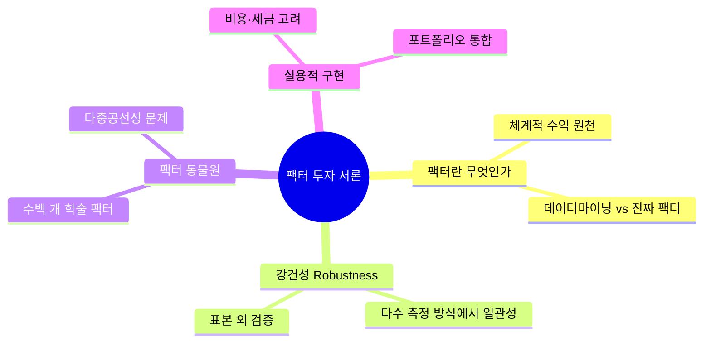
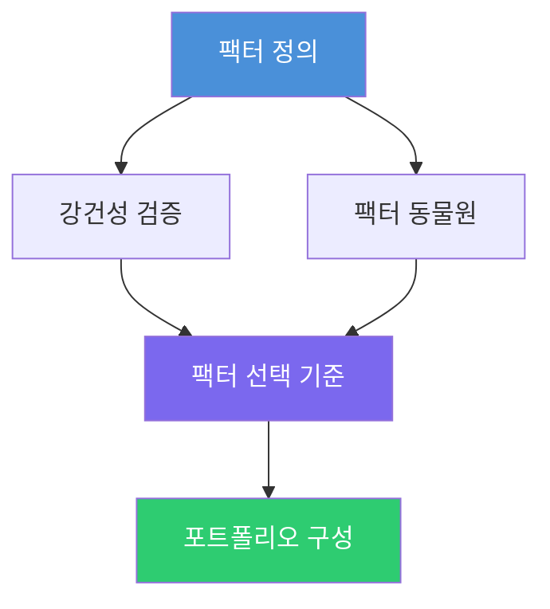

# 개념 시각화 가이드

Study Companion 스킬의 개념 시각화 기능 상세 가이드.

---

## 1. 기본 시각화 — Mermaid 마인드맵

### 언제 사용하는가

- 매 챕터 학습 완료 직후 자동 제공
- `VISUALIZE` 의도 감지 시
- `ACQUIRE` 단계에서 핵심 개념 소개 시

### Mermaid 마인드맵 생성 규칙

1. `metadata.json`에서 현재 챕터의 `key_concepts` 목록 로드
2. Knowledge Graph에서 개념 간 `prerequisite_of` 관계 조회
3. 중심 노드 = 챕터 제목, 1차 노드 = 핵심 개념, 2차 노드 = 하위 개념

#### 마인드맵 예시 (Factor-Based Investing, Ch00 Introduction)



#### Mermaid 플로우차트 예시 (개념 간 선수 관계)



### 개념도를 Obsidian에 저장하는 방법

개념 노트 (`Concepts/{book-title}/{ChXX}_{title}_개념노트.md`) 하단에 다음 섹션을 추가:

```markdown
## 개념 관계도


```

`patch_vault_file(path, appended_content)`로 기존 노트에 추가.

---

## 2. 고급 인포그래픽 — Sequential Thinking 활용

### 전제 조건

- `sequential-thinking` MCP가 Claude Desktop에 연결되어 있어야 함
- 사용자가 명시적으로 요청: "인포그래픽 만들어줘", "전문적인 개념도", "출판물 수준 시각화"

### 실행 절차

1. `sequential-thinking` MCP의 `sequentialthinking` 도구 호출
2. `references/prompts.md §6.12` (`INFOGRAPHIC_THINKING_TPL`)의 프롬프트를 `thought` 파라미터로 전달
3. 도구가 반환하는 단계별 결과를 축적
4. 최종 결과 (Mermaid 코드 + 설계서) 사용자에게 렌더링

### sequential-thinking MCP 호출 예시

```python
# content_generator.py 내 visualize_chapter_advanced() 호출 패턴
result = mcp__sequential_thinking__sequentialthinking(
    thought=INFOGRAPHIC_THINKING_TPL.format(
        book_title=book_title,
        chapter_title=chapter_title,
        key_concepts_list=json.dumps(key_concepts, ensure_ascii=False),
        concept_relationships=json.dumps(relationships, ensure_ascii=False)
    ),
    nextThoughtNeeded=True,
    thoughtNumber=1,
    totalThoughts=6
)
```

### 폴백 처리

`sequential-thinking` MCP 미연결 시:
1. 사용자에게 안내: "sequential-thinking MCP가 연결되지 않아 기본 Mermaid 마인드맵으로 제공합니다."
2. 기본 마인드맵 생성 후 제공
3. INSTALL.md의 sequential-thinking 설치 가이드로 안내

---

## 3. 시각화 유형 선택 가이드

| 챕터 내용 특성 | 권장 시각화 유형 | Mermaid 유형 |
|--------------|--------------|------------|
| 개념 간 위계 관계 명확 | 계층형 트리 | `flowchart TD` |
| 중심 개념에서 방사형 확장 | 마인드맵 | `mindmap` |
| 프로세스·순서 있는 흐름 | 순환 플로우 | `flowchart LR` |
| 두 가지 대조·비교 | 비교 다이어그램 | `flowchart TB` (두 브랜치) |
| 시간 순서·발전 과정 | 타임라인 | `timeline` |
| 상태 전이 | 상태 다이어그램 | `stateDiagram-v2` |

---

## 4. 색상 체계 (기본값)

| 역할 | 색상 | Hex |
|------|------|-----|
| 핵심 개념 (앵커) | 진한 파랑 | `#4A90D9` |
| 1차 연결 개념 | 보라 | `#7B68EE` |
| 2차 연결 개념 | 연한 회색 | `#B0BEC5` |
| 달성/완료 개념 | 초록 | `#2ECC71` |
| 약점/주의 개념 | 주황 | `#F39C12` |

Mermaid 스타일 적용:
```
style {node_id} fill:{color},color:#fff,stroke:#333
```

---

## 5. Obsidian 렌더링 확인

Obsidian에서 Mermaid 다이어그램이 렌더링되려면:
- Settings → Core plugins → Mermaid diagrams 활성화 (기본값 ON)
- Obsidian 버전 0.12+ 필요
- Live Preview 또는 Reading View에서 렌더링 확인
