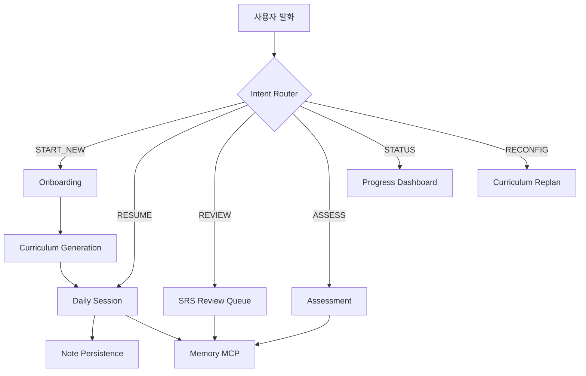
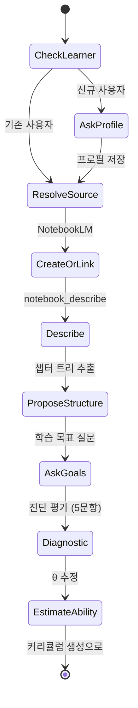
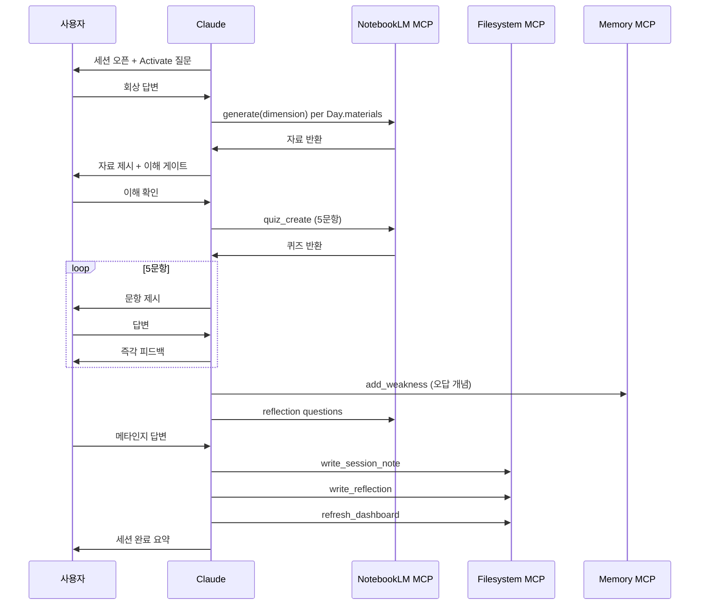
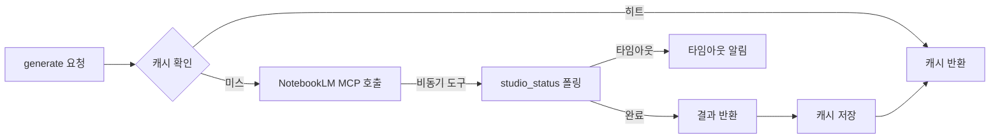
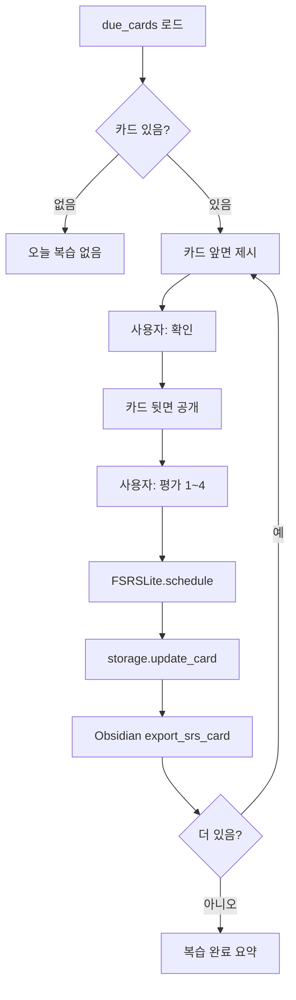
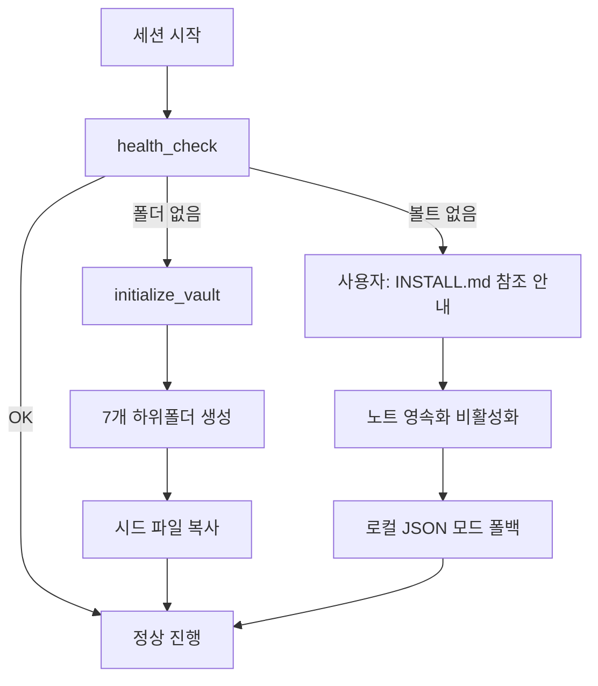

# 워크플로우 다이어그램

## 1. 전체 스킬 흐름 (Intent Router)

```mermaid
flowchart TD
    A[사용자 발화] --> B{Intent Router}
    B -->|START_NEW| C[Onboarding]
    B -->|RESUME| D[Daily Session]
    B -->|REVIEW| E[SRS Review Queue]
    B -->|ASSESS| F[Assessment]
    B -->|STATUS| G[Progress Dashboard]
    B -->|RECONFIG| H[Curriculum Replan]
    
    C --> I[Curriculum Generation]
    I --> D
    D --> J[Note Persistence]
    F --> K[Memory MCP]
    E --> K
    D --> K
```

## 2. Onboarding State Machine

```mermaid
stateDiagram-v2
    [*] --> CheckLearner
    CheckLearner --> AskProfile: 신규 사용자
    CheckLearner --> ResolveSource: 기존 사용자
    AskProfile --> ResolveSource: 프로필 저장
    ResolveSource --> CreateOrLink: NotebookLM
    CreateOrLink --> Describe: notebook_describe
    Describe --> ProposeStructure: 챕터 트리 추출
    ProposeStructure --> AskGoals: 학습 목표 질문
    AskGoals --> Diagnostic: 진단 평가 (5문항)
    Diagnostic --> EstimateAbility: θ 추정
    EstimateAbility --> [*]: 커리큘럼 생성으로
```

## 3. Daily Session 4-Stage Loop

```mermaid
sequenceDiagram
    participant U as 사용자
    participant C as Claude
    participant NLM as NotebookLM MCP
    participant FS as Filesystem MCP
    participant MEM as Memory MCP

    C->>U: 세션 오픈 + Activate 질문
    U->>C: 회상 답변
    C->>NLM: generate(dimension) per Day.materials
    NLM->>C: 자료 반환
    C->>U: 자료 제시 + 이해 게이트
    U->>C: 이해 확인
    C->>NLM: quiz_create (5문항)
    NLM->>C: 퀴즈 반환
    loop 5문항
        C->>U: 문항 제시
        U->>C: 답변
        C->>U: 즉각 피드백
    end
    C->>MEM: add_weakness (오답 개념)
    C->>NLM: reflection questions
    U->>C: 메타인지 답변
    C->>FS: write_session_note
    C->>FS: write_reflection
    C->>FS: refresh_dashboard
    C->>U: 세션 완료 요약
```

## 4. 콘텐츠 캐시 흐름

```mermaid
flowchart LR
    A[generate 요청] --> B{캐시 확인}
    B -->|히트| C[캐시 반환]
    B -->|미스| D[NotebookLM MCP 호출]
    D -->|비동기 도구| E[studio_status 폴링]
    E -->|완료| F[결과 반환]
    E -->|타임아웃| G[타임아웃 알림]
    F --> H[캐시 저장]
    H --> C
```

## 5. SRS 복습 큐

```mermaid
flowchart TD
    A[due_cards 로드] --> B{카드 있음?}
    B -->|없음| C[오늘 복습 없음]
    B -->|있음| D[카드 앞면 제시]
    D --> E[사용자: 확인]
    E --> F[카드 뒷면 공개]
    F --> G[사용자: 평가 1~4]
    G --> H[FSRSLite.schedule]
    H --> I[storage.update_card]
    I --> J[Obsidian export_srs_card]
    J --> K{더 있음?}
    K -->|예| D
    K -->|아니오| L[복습 완료 요약]
```

## 6. Obsi_Sapi 볼트 초기화

```mermaid
flowchart TD
    A[세션 시작] --> B[health_check]
    B -->|OK| C[정상 진행]
    B -->|볼트 없음| D[사용자: INSTALL.md 참조 안내]
    B -->|폴더 없음| E[initialize_vault]
    E --> F[7개 하위폴더 생성]
    F --> G[시드 파일 복사]
    G --> C
    D --> H[노트 영속화 비활성화]
    H --> I[로컬 JSON 모드 폴백]
    I --> C
```
